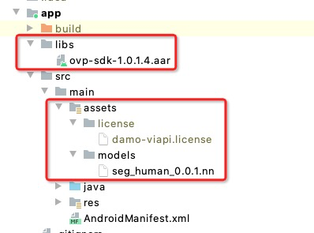
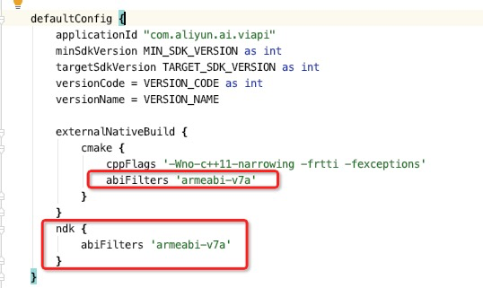

# 1 概述
viapi-android-sdk-demo 是阿里达摩院推出的一款适用于 Android 平台的实时视频 SDK，提供了包括人像抠图、美颜、人像关键点检测等多种功能。

# 2 功能列表
+ 相机实时人像分割
+ 单张图片人像分割
+ ~~美颜功能（瘦脸、大眼、美白、磨皮等）~~
+ ~~人脸关键点检测~~

# 3 SDK开发包适配及包含内容说明
## 3.1 支持的系统和硬件版本
+ 硬件要求：要求设备上有相机模块,陀螺仪模块。
+ CPU架构：armeabi-v7a。
+ 系统：最低支持 Android 4.0（API Level 14），需要开发者通过minSdkVersion来保证支持系统的检测。

## 3.2 开发包资源说明
+ ovp-sdk-1.0.1.3.aar --viapi的sdk的aar包
+ damo-viapi.license  --license文件
+ seg_human_0.0.1.nn  --人像分割模型文件

# 4 SDK集成步骤
## 4.1 将算法能力相关的文件包导入到工程
把sdk的aar拷贝到主工程libs目录下，把模型文件xxx.nn文件和.license文件拷贝到工程app module的assets目录下如下图：



**注意：不要修改license文件名称及存放的路径。**
## 4.2 工程gradle配置
在主工程的build.gradle文件相关配置设置，主工程的build.gradle文件在Project目录中位置如下图：



```
android {
   defaultConfig {
       ndk {
           //设置支持的SO库架构
           abiFilters "armeabi-v7a"
           }
        }
}
```
# 5 SDK调用步骤
## 5.1 SDK初始化
#### 接口描述：
算法API使用前先调用SDK初始化接口，初始化之后，各功能才可以正常使用，否则会引起鉴权等异常，初始化建议放在app进程启动时Application onCreate中进行。

#### 初始化接口：
```
VIAPICreateApi.getInstance().getVIAPISdkCore().init(Context context);
```
#### 参数说明：
Context context 应用上下文。

#### 返回值 ：
int类型，返回0为初始化成功，其它返回为初始化失败，具体请参考6.1 错误码含义。

#### 具体代码示例如下：
```
  private void initSDK() {
    int status = VIAPICreateApi.getInstance().getVIAPISdkCore().init(this);
    if (status != 0) {
        Toast.makeText(this, VIAPIStatusCode.getErrorMsg(status), Toast.LENGTH_LONG).show();
    } else {
        Toast.makeText(this, "初始化成功！", Toast.LENGTH_LONG).show();
    }
}
```
## 5.2 人像分割API使用
### 5.2.1 创建算法实例
#### 接口描述：
在需要用到图像分割算法的地方，声明算法对象，创建算法实例HumanSegment，HumanSegment对象，HumanSegment是人像分割API接口对象，通过此对象可以完成对图像分割能力的使用。

#### 算法实例化接口：
```
HumanSegment mHumanSegment = new HumanSegment();
```

#### 参数说明：
无
#### 返回值:
无
#### 具体代码示例如下：
```
private final HumanSegment mHumanSegment;
mHumanSegment = new HumanSegment();
```
### 5.2.3 获取.license的路径
#### 接口描述：
获取鉴权文件的路径非常重要，路径获取有问题，后续的证书验签会失败，导致算法调用失败，具体实现可参考Demo。
#### 获取证书路径：
```
VIAPICreateApi.getInstance().getVIAPISdkCore().getLicensePath();
```
#### 参数说明：
无
#### 返回值：
无
#### 具体代码示例如下：
```
String licensePath = VIAPICreateApi.getInstance().getVIAPISdkCore().getLicensePath();
```
### 5.2.4 license鉴权
#### 接口描述：
license证书验签接口，验签通过后才能成功调用算法。
#### license证书验签接口：
```
mHumanSegment.nativeCheckLicense(String licensePath);
```
#### 参数说明：
String licensePath  5.2.3 中获取的.license路径。

#### 返回值：
int类型，返回0为验签成功，其它返回为验签失败。
#### 具体代码示例如下：
```

int errorCode = mHumanSegment.nativeCheckLicense(licensePath);
```
### 5.2.5 创建算法实例
#### 接口描述：
创建算法内部用于图像分割的实例对象，为图像分割做准备。
#### 接口示例：
HumanSegment.nativeSegmentCreate();
#### 参数说明：
无
#### 返回值：
int类型，返回0为创建算法实例成功，其它返回为创建算法实例失败。
#### 具体代码示例如下：
```
int errorCode = = mHumanSegment.nativeSegmentCreate();
```
### 5.2.6 算法init初始化
#### 接口描述：
初始化实例之后的算法对象
#### 接口示例：
HumanSegment.nativeSegmentInit(String modelsPath);
#### 参数说明：
String modelsPath 为算法模型文件系统的绝对路径。
#### 返回值：
int类型，返回0为算法初始化成功，其它返回为算法初始化失败。
#### 具体代码示例如下：
```
int errorCode = mHumanSegment.nativeSegmentInit(modelsPath);
```
**注意：5.2.4、5.2.5、5.2.6步为算法初始化，init方法比较耗时，建议在后台线程执中行操作。**
### 5.2.7 相机流图像分割算法处理
#### 接口描述：
该方法为处理图像分割的接口，传入camera的原始nv21数据，获得图像分割后的图像buffer输出数据。适用于相机预览、视频播放处理。
#### 接口示例：
```
HumanSegment.nativeSegmentProcessBuffer(byte[] yuv420sp,int textureWidth,int textureHeight,int angle,int cameraFace,int step,ByteBuffer mDstBuffer);
```
#### 参数说明：
+ yuv420sp：相机输入数据。Camera1可以通过onPreviewFrame回调获得，Camera2可以通过onImageAvailable回调获得。
+ textureWidth：预览图像的宽。
+ textureHeight：预览图像的高。
+ angle：图像旋转的角度。可通过Sensor对设备旋转角度判断获得，计算方法详见demo。
+ cameraFace：相机的前后摄像头 前置为1 后置为0。
+ step：算法的步数，算法规定，算法处理帧第一帧传0，其他帧传1。
+ mDstBuffer：算法处理后的输出数据。

#### 返回值:
int类型，返回0为图像分割算法处理成功，其它返回为图像分割算法处理失败。
#### 调用样例代码如下:
```
 public synchronized int processSegmentForBuffer(byte[] yuv420sp, int textureWidth, int textureHeight, int cameraFace, int angle) {
        if (!mInitSegment.get() || (blendImageBg == null)) {
            return -1;
        }

        if (mTexHeight != textureHeight || mTexWeight != textureWidth) {
            releaseGL();
            mTexHeight = textureHeight;
            mTexWeight = textureWidth;
            mDstBuffer = ByteBuffer.allocateDirect(textureWidth * textureHeight * 4);
        }
        if (mDstBuffer == null) {
            mDstBuffer = ByteBuffer.allocateDirect(textureWidth * textureHeight * 4);
        }
        mDstBuffer.clear();
        synchronized (mInitLock) {
            mHumanSegment.nativeSegmentProcessBuffer(yuv420sp, textureWidth, textureHeight, angle, cameraFace, sep, mDstBuffer);
        }
        if (sep == 0) {
            sep = 1;
        }
        //如果需要进行OpenGL渲染，所有OpenGL相关的操作必须放在OpenGL线程中，下面方法需要在有openGL上下文环境的线程调用
        mSegmentTexId = OpenGLUtil.loadTexture(mDstBuffer, textureWidth, textureHeight, mSegmentTexId);
        return mSegmentTexId;
    }
```

**注意：算法内部没有对内存进行处理，输出buffer需提前申请内存空间，初始化格式为：**
```
mDstBuffer = ByteBuffer.allocateDirect(textureWidth * textureHeight * 4);
```
### 5.2.8 单张图片的分割
#### 接口描述:
该接口可以进行单张图片的分割，适用于手机拍照、手机相册选择图片等场景。
#### 接口示例：
```
public native int nativeSegmentProcessPicture(byte[] data,int format, int width, int height, int channel, byte[] out);
```
#### 参数说明：
+ data：待处理的图片数据。
+ format：待处理的图片数据格式：保留字段，目前传入无意义，目前支持RGBA。
+ width：data图像数据的宽。
+ height：data 图像数据的高。
+ channel： 数据通道数，目前只需要传4即可。
+ out：    算法处理后返回的图片buffer数据。

#### 返回值：
int类型，返回0为图像分割算法处理成功，其它返回为图像分割算法处理失败。
#### 具体代码示例如下：
```
mHumanSegment.nativeSegmentProcessPicture(data,1,width,height,channel,out);
```
**注意：算法内部没有对内存进行处理，输出buffer需提前申请内存空间，初始化格式为：**
```
ByteBuffer dstBuffer = ByteBuffer.allocateDirect(bitmap.getWidth() * bitmap.getHeight() * 4);
```

### 5.2.9 算法Clear操作
#### 接口描述：
与init成对使用，反init操作，在不需要用到算法的时候，进行算法资源的删除。
#### 接口示例：
```
HumanSegment.nativeSegmentClear();
```
#### 参数说明：
无
#### 返回值：
int类型，返回0为删除算法相关成功，其它返回为删除算法相关处理失败。
#### 具体代码示例如下：
```
  mHumanSegment.nativeSegmentClear();
```
**注意：nativeSegmentClear调用之后，再次使用必须重新调用5.2.6 nativeSegmentInit 进行算法初始化**

### 5.2.10 算法销毁Destroy
#### 接口描述：
在不需要用到算法的时候，对算法对象的销毁内存释放操作。
#### 接口示例：
```
HumanSegment.nativeSegmentDestroy();
```
#### 参数说明:
无
#### 返回值：
int类型，返回0为销毁算法相关成功，其它返回为销毁算法相关处理失败。
#### 具体代码示例如下：
```
  mHumanSegment.nativeSegmentDestroy();
```
**注意：5.2.9、5.2.10需在不需mHumanSegment对象的时候先clear再destroy**
### 5.2.11 各方法调用顺序说明
1. 先在Application设置 5.2.1 SDK初始化化：VIAPICreateApi.getInstance().getVIAPISdkCore().init(Context context);
2. 创建算法实例 5.2.2 ：HumanSegment mHumanSegment = new HumanSegment();
3. license验签 5.2.4 ：mHumanSegment.nativeCheckLicense(String licensePath);
4. 创建算法对象实例 5.2.5 ：HumanSegment.nativeSegmentCreate();
5. 算法init初始化操作 5.2.6 ：HumanSegment.nativeSegmentInit(String modelsPath);
6. 相机流图像分割算法处理 5.2.7 ：HumanSegment.nativeSegmentProcessBuffer(byte[] yuv420sp,int textureWidth,int textureHeight,int angle,int cameraFace,int step,ByteBuffer mDstBuffer);
7. 单张图片的分割 5.2.8：public native int nativeSegmentProcessPicture(byte[] data,int format, int width, int height, int channel, byte[] out);
8. 算法clear操作 5.2.9 ：HumanSegment.nativeSegmentClear();
9. 销毁算法对象 5.2.10 ：HumanSegment.nativeSegmentDestroy();

**注意：6、7为视频抠图和单张图片抠图，不分前后顺序，可根据具体场景调用**

## 5.3 美颜API使用

### 5.3.1 美颜算法实例对象

# 6 离线鉴权错误码定义
## 6.1 错误码含义
+ -211  license没有初始化直接调用API接口。
+ -212  当前的license与调用app不是绑定关系，license用在其他app中使用。
+ -213  license无效。
+ -214  license授权时间过期。
+ -215  此license中不包含调用的算法能力（未购买此能力）。
+ -216  bundle id获取失败。

# 7 Demo说明
+ 项目实时视频图像分割渲染及背景叠加是通过openGL相关操作渲染的，详见demo。
+ 运行demo时，需将正式的license替换到assets目录，且applicationID(包名)和license对应。
+ sdk的license包含了多个算法能力。如用户申请的license不包含其中的某算法能力，调用此算法API对应的接口时，没有效果，错误提示详见错误码。

# 8 license过期时间获取
#### 接口描述：
获取当前SDK中license的过期时间
#### 接口示例：
```
  String sdkExpireTime = VIAPICreateApi.getInstance().getVIAPISdkCore().getLicenseExpireTime();
```

#### 返回值：
license过期时间
#### 具体代码示例如下：
```
    String sdkExpireTime = VIAPICreateApi.getInstance().getVIAPISdkCore().getLicenseExpireTime();
    if (!TextUtils.isEmpty(sdkExpireTime)) {
      Logs.i(TAG, "到期日 = " + sdkExpireTime + ", 距离到期天数 = " + licenseExpireDays(sdkExpireTime));
    }
    private int licenseExpireDays(String sdkExpireTime) {
        int days = 0;
        SimpleDateFormat sdf = new SimpleDateFormat("yyyy-MM-dd");
        Date expireData;
        Date today = new Date();
        try {
            expireData = sdf.parse(sdkExpireTime);
            days = (int) ((expireData.getTime() - today.getTime()) / (1000 * 3600 * 24));
        } catch (ParseException e) {
            e.printStackTrace();
        }
        return days;
    }
```

# 9 注意事项
+ viapi-android-sdk的 minSdkVersion为 14。
+ demo工程Android Studio 3.4 及以上，Open GLES 2.0 及以上。